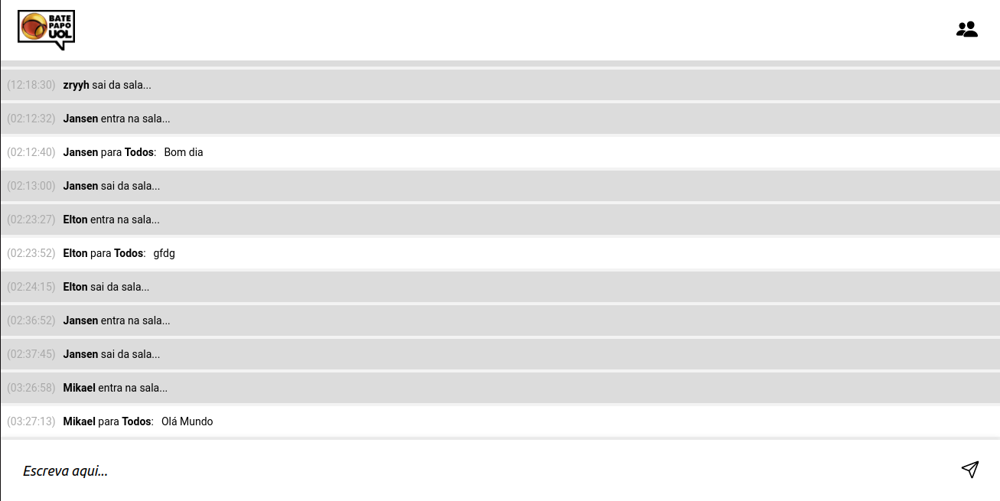
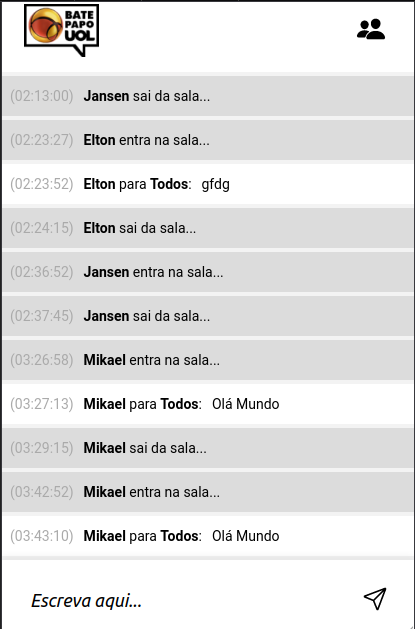

# Bate Papo UOL
## Projeto 05

---
## ✒️ Descrição:
Quinto projeto do Pimeiro Módulo do curso de Desenvolvimento Full Stack da Driven Education.  

O Bate Papo UOL é um chat totalmente funcional, onde você pode se comunicar com outras pessoas conectadas.

---
## 🎯 Requisitos:

✅ Fazer o versionamento do código usando o GitHub.  
✅ Recriar o layout fornecido no figma.  
✅ Buscar novas mensagens do servidor.  
✅ Rolagem automática para novas mensagens.  
✅ Input para inserir nome de usuário.  
✅ Enviar mensagens para o servidor

---

  <h2>Tecnologias utilizadas:</h2>
  
  
  
   

---

  

## 💻 Prévia Desktop 💻  

---
## 📱 Prévia Mobile 📱  

